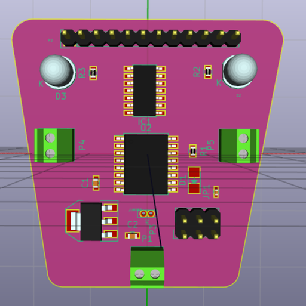

## Introductory workshop.

- Attiny84
- avrdude/WinAVR
- USB ASP programmer
- Makefile
- LED blink
- PWM
- Ultrasonic sensor
- L293D
- 2WD Chassis

## Applications of tinyDriver

- 2WD robot
- Laser Display (rotating mirrors)
- Servos?
